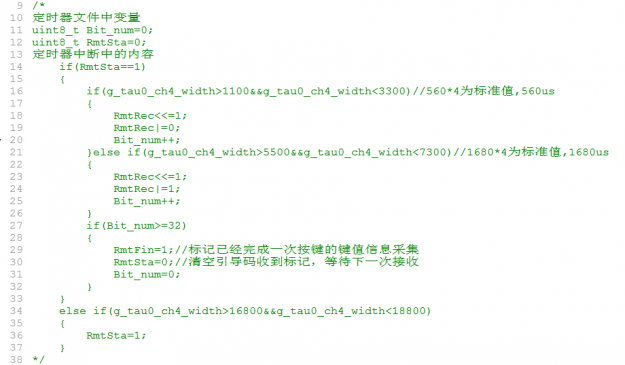

# 基于瑞萨RL78G13的矩阵键盘、SPI_LCD、红外遥控和超声波测距模块代码

## 矩阵键盘

共包含两个文件：

根据源码中的说明设置相应的引脚即可使用。

在这两个文件中引入了delay.h文件，主要是实现了ms级延时，矩阵键盘消抖用到delay_ms()函数。

## LCD（模拟SPI版）

共包含两个文件：

根据源码中的说明设置相应的引脚即可使用。

## 红外遥控

设置定时器为捕获模式后，根据说明更改相应内容即可使用。

这两个文件就是红外遥控的代码，在定时器的文件中要修改相应内容。

## 超声波模块

共包含两个文件，根据源码中的说明进行相应的设置即可。

