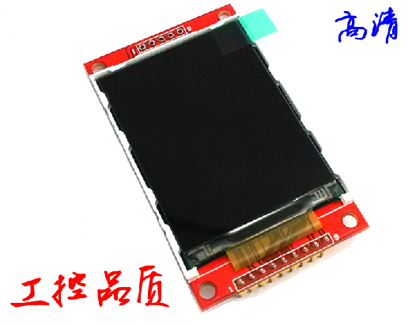
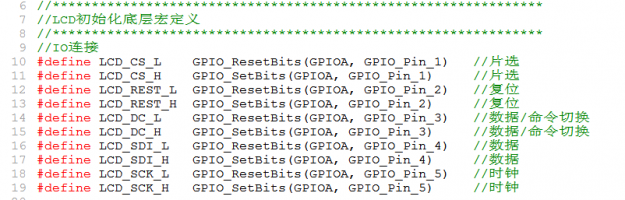
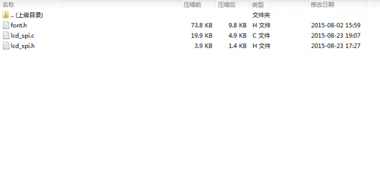

# 基于STM32F103的LCD源代码（模拟SPI版）

这是基于STM32F103的LCD源代码，LCD是SPI版的，如图：

在本代码中，IO连接如下：

 

- 片选CS-->PA1
- 复位REST-->PA2
- 数据/命令切换DC-->PA3
- 数据SDI-->PA4
- 时钟SCK-->PA5

要驱动这款LCD最少只需占用4个IO口，就能实现TFT的完美显示效果，简单好用可以将 LCD_CS 接地，LCD_LED 3.3V，LCD_RST 接至单片机复位端。
压缩包中有三个文件，font.h是字模文件，lcd_spi.c和lcd_spi.h是LCD的驱动文件，把这三个文件添加到工程即可使用。

注意：程序中使用了Delay_ms()延时函数，需要实现。
 

本程序兼容原子哥的例程代码，实现了12*12、16*16、24*24、32*32大小的中、英文显示（中文需要取模），实现图片的显示（需要取模）。